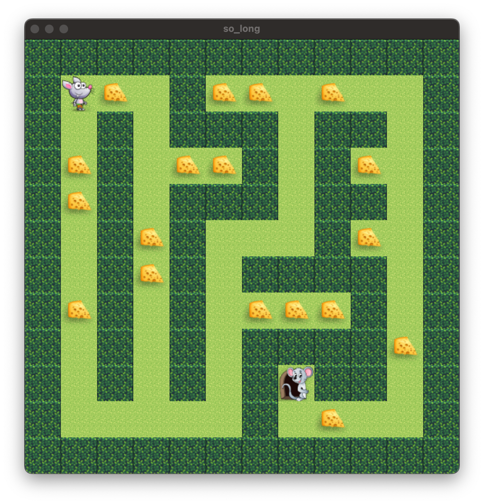

# so_long
Embark on a thrilling adventure with so_long, a simple 2D game where the player navigates a maze-like environment, evading obstacles to reach the ultimate goal. Crafted using the MiniLibX library, this project challenged me to delve into game mechanics, file I/O operations, and fundamental graphics programming. Through its development, I acquired skills in game design principles, file handling techniques, and the implementation of graphical interfaces, advancing my growth as a developer.

## Gameplay Video
<video width="1280" height="720" controls>
  <source src="Readme_files/video.mp4" type="video/mp4">
  Your browser does not support the video tag.
</video>
